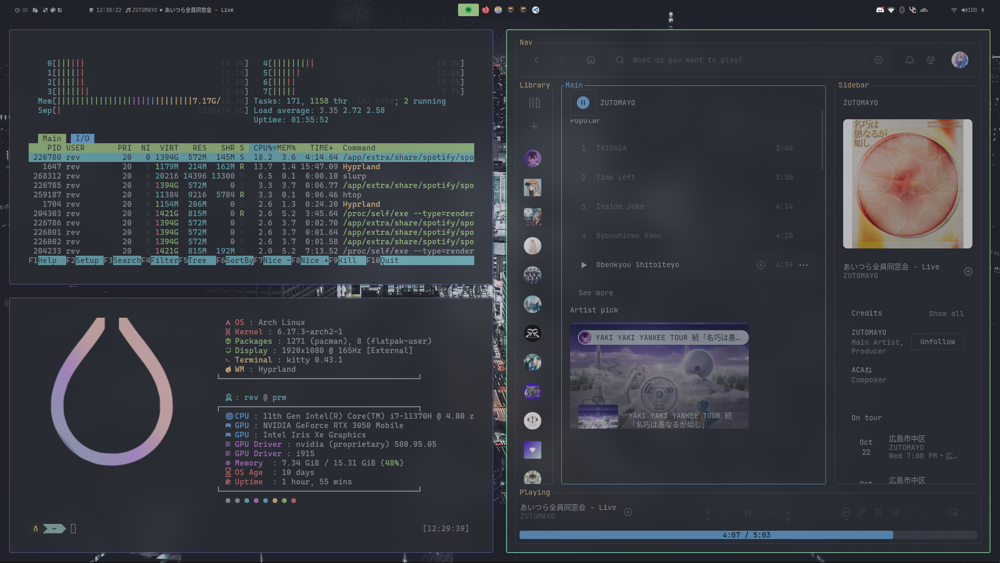
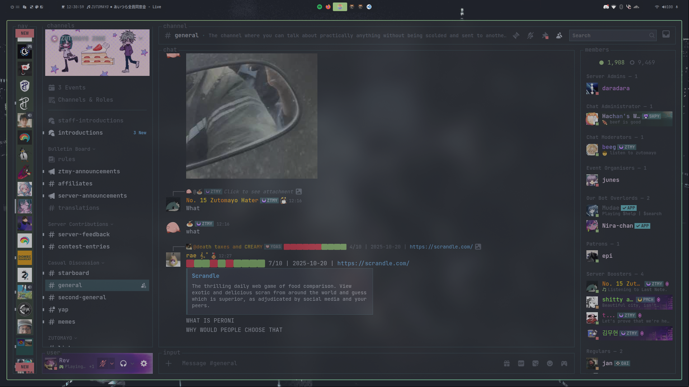
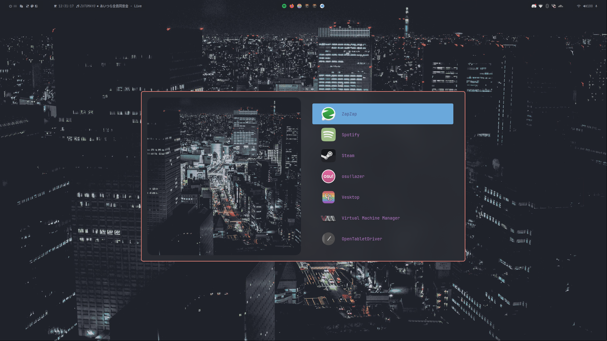

# Dotfiles

My personal dotfiles for My Arch + Hyprland Setup

## 🖥️ Setup Info

- **OS**: Arch Linux
- **WM**: Hyprland
- **Theme Engine**: HyDE
- **Terminal**: Kitty
- **Shell**: Zsh
- **Bar**: Waybar
- **Launcher**: Rofi
- **Notifications**: Dunst

## 📦 Installation

### Prerequisites

Make sure you have HyDE installed. If not, install it first:
```bash
# Install HyDE
# Follow instructions from: https://github.com/HyDE-Project/HyDE
```

### Quick Install

```bash
# Clone this repository
git clone https://github.com/revprm/dotfiles.git ~/dotfiles
cd ~/dotfiles

# Run installation script
chmod +x scripts/install.sh
./scripts/install.sh
```

### Manual Install

```bash
# Create backup
./scripts/backup.sh

# Create symlinks
./scripts/symlink.sh
```

## 📁 Structure

```
dotfiles/
├── .config/          # Configuration files
├── .local/           # Local data and libraries
├── home/             # Home directory files
├── scripts/          # Helper scripts
└── docs/             # Documentation
```

## 🎨 Customization

- Edit Hyprland config: `.config/hypr/`
- Change theme: Use HyDE theme selector or edit `.config/hyde/`
- Modify Waybar: `.config/waybar/`
- Terminal colors: `.config/kitty/`

## 📸 Screenshots








## 🙏 Credits

- [HyDE](https://github.com/HyDE-Project/HyDE)
- [Hyprland](https://hyprland.org/)

## 📝 License

MIT License - Feel free to use and modify!
