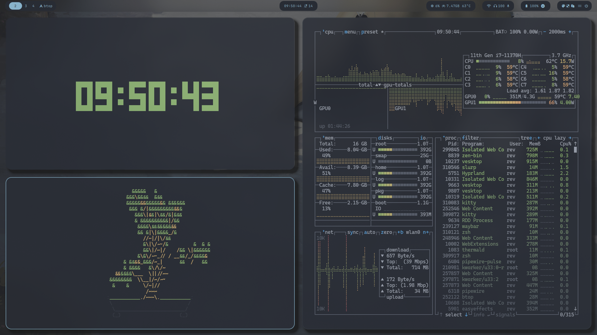
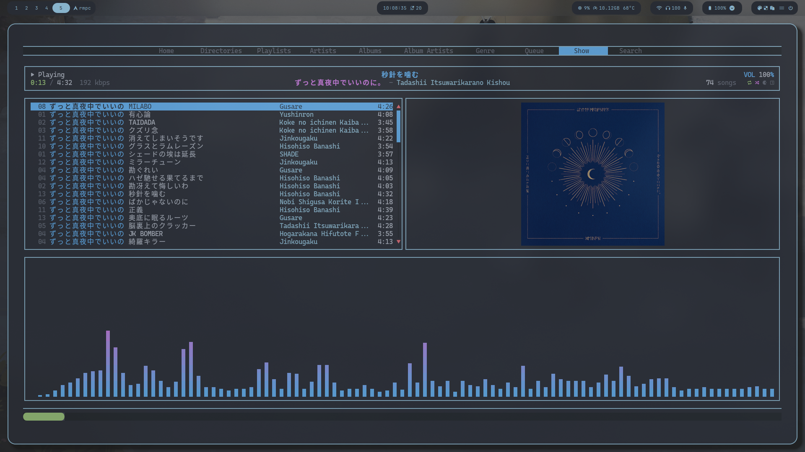
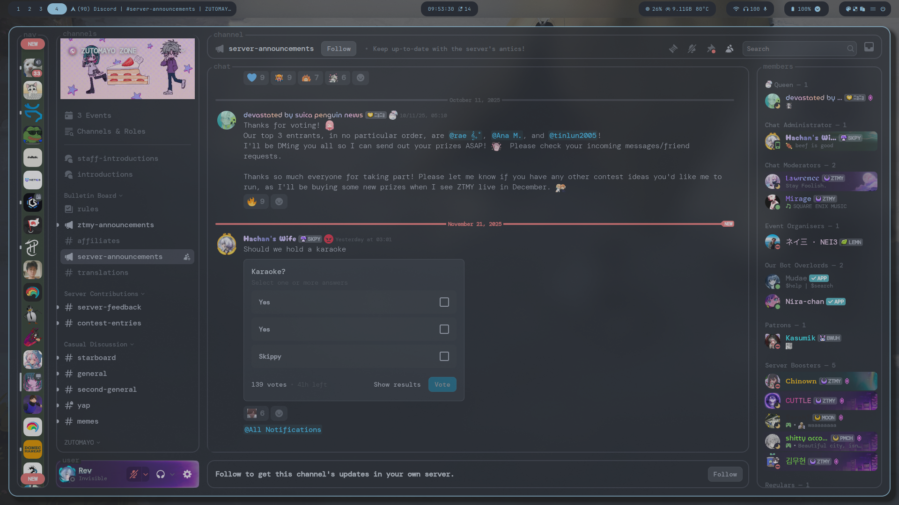
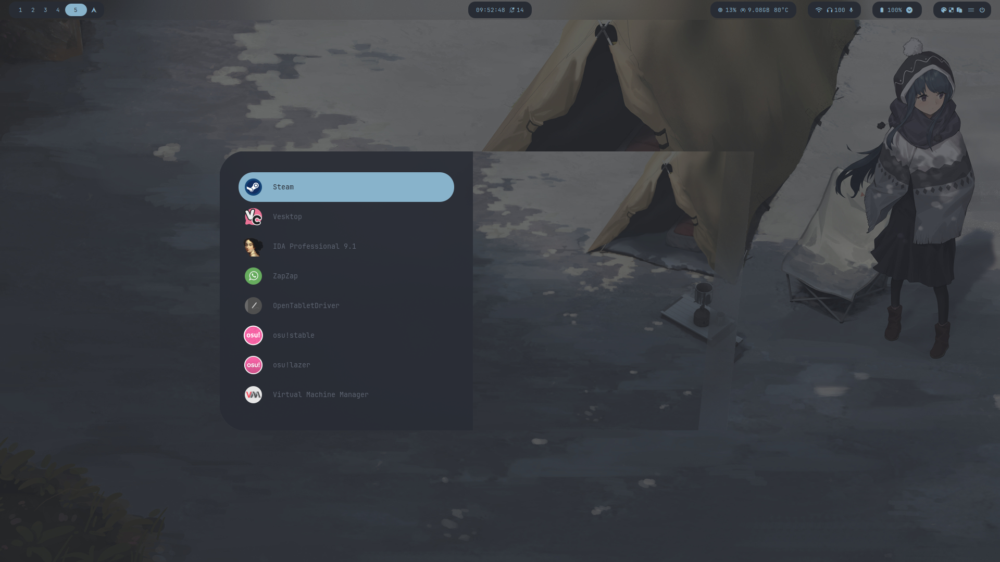
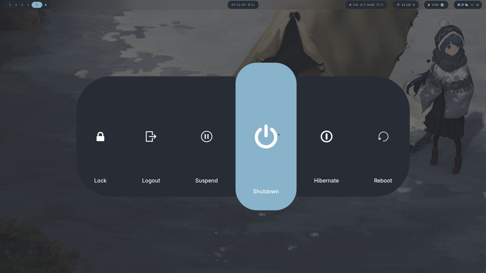

<div align="center">

# ✨ Dotfiles

_My personal configuration files for a beautiful Arch Linux + Hyprland setup_

[](https://archlinux.org/)
[](https://hyprland.org/)
[](LICENSE)

</div>

---

## 🖥️ System Information

| Component          | Tool              |
| ------------------ | ----------------- |
| **OS**             | Arch Linux        |
| **Window Manager** | Hyprland          |
| **Theme Engine**   | HyDE              |
| **Terminal**       | Kitty             |
| **Shell**          | Zsh               |
| **Status Bar**     | Waybar            |
| **App Launcher**   | Rofi              |
| **Notifications**  | Dunst             |
| **Logout Menu**    | Wlogout           |
| **System Monitor** | Btop              |
| **Fetch Tool**     | Fastfetch         |
| **Qt Theme**       | Kvantum           |
| **Music Player**   | RMPC              |
| **Chat Client**    | Vesktop (Discord) |

## 📦 Installation

### Prerequisites

> **Important:** These dotfiles are designed to work with HyDE (Hyprland Desktop Environment). Make sure you have HyDE installed first.

**Required:**

- HyDE installed and configured ([Installation Guide](https://github.com/HyDE-Project/HyDE))
- Git
- Zsh

**Optional Dependencies:**

- Kitty (terminal emulator)
- Rofi (application launcher)
- Waybar (status bar)
- Dunst (notification daemon)

### Quick Install

```bash
# Clone this repository
git clone https://github.com/revprm/dotfiles.git ~/dotfiles
cd ~/dotfiles

# Make scripts executable
chmod +x scripts/*.sh

# Run the installation script (includes backup)
./scripts/install.sh
```

The install script will:

1. ✅ Create a timestamped backup of your existing configs
2. ✅ Create necessary directories
3. ✅ Symlink all dotfiles to appropriate locations
4. ✅ Preserve your current setup in case you need to rollback

### Manual Installation

If you prefer more control over the installation process:

```bash
# 1. Backup your current configs
./scripts/backup.sh

# 2. Create symlinks
./scripts/symlink.sh

# 3. To undo changes (if needed)
./scripts/unsymlink.sh
```

## 📁 Structure

```
dotfiles/
├── .config/              # Application configurations
│   ├── hypr/            # Hyprland compositor settings
│   ├── hyde/            # HyDE theme engine configs
│   ├── waybar/          # Status bar configuration
│   ├── kitty/           # Terminal emulator settings
│   ├── rofi/            # Application launcher themes
│   ├── dunst/           # Notification daemon config
│   ├── zsh/             # Zsh shell configuration
│   ├── btop/            # System monitor theme
│   ├── fastfetch/       # System info fetch config
│   ├── vim/             # Vim text editor settings
│   ├── wlogout/         # Logout menu configuration
│   ├── Kvantum/         # Qt application theming
│   ├── qt5ct/           # Qt5 theme settings
│   ├── qt6ct/           # Qt6 theme settings
│   ├── gtk-3.0/         # GTK3 theme settings
│   ├── rmpc/            # Music player config
│   └── vesktop/         # Discord client settings
├── .local/              # Local user data and libraries
│   ├── lib/             # Local libraries
│   └── share/           # Shared application data
├── home/                # Home directory dotfiles
├── scripts/             # Utility scripts
│   ├── install.sh       # Main installation script
│   ├── backup.sh        # Backup existing configs
│   ├── symlink.sh       # Create symlinks
│   ├── unsymlink.sh     # Remove symlinks
│   └── services/        # System service scripts
├── docs/                # Documentation files
└── images/              # Screenshots and images
```

## 🎨 Customization

### Key Configuration Locations

| Component      | Configuration Path     | Description                                   |
| -------------- | ---------------------- | --------------------------------------------- |
| **Hyprland**   | `.config/hypr/`        | Window manager settings, keybinds, animations |
| **HyDE Theme** | `.config/hyde/`        | Theme selector and engine configs             |
| **Waybar**     | `.local/share/waybar/` | Status bar modules and styling                |
| **Kitty**      | `.config/kitty/`       | Terminal colors, fonts, and behavior          |
| **Rofi**       | `.config/rofi/`        | Launcher themes and modi                      |
| **Dunst**      | `.config/dunst/`       | Notification appearance and rules             |
| **Zsh**        | `.config/zsh/`         | Shell aliases, functions, and plugins         |

### Quick Customization Tips

<details>
<summary><b>🎨 Changing Themes</b></summary>

Use the built-in HyDE theme selector:

```bash
# Open HyDE theme selector
hyde theme select
```

Or manually edit theme files in `.config/hyde/`

</details>

<details>
<summary><b>⌨️ Modifying Keybinds</b></summary>

Edit Hyprland keybindings in `.config/hypr/hyprland.conf`:

```bash
# Example: Change terminal keybind
bind = $mainMod, Return, exec, kitty
```

</details>

<details>
<summary><b>🎯 Waybar Customization</b></summary>

Waybar modules can be customized in `.local/share/waybar/`:

- `config` - Module configuration
- `style.css` - Visual styling

</details>

<details>
<summary><b>🖼️ Terminal Colors</b></summary>

Edit Kitty color scheme in `.config/kitty/`:

```bash
kitty +kitten themes
```

</details>

## 📸 Screenshots

<details open>
<summary><b>🪟 Tiling Window Layout</b></summary>



</details>

<details>
<summary><b>🎵 Music Player (RMPC)</b></summary>



</details>

<details>
<summary><b>💬 Discord (Vesktop)</b></summary>



</details>

<details>
<summary><b>🚀 Application Launcher (Rofi)</b></summary>



</details>

<details>
<summary><b>🔒 Lock Screen</b></summary>



</details>

---

## 🛠️ Scripts

| Script                          | Purpose                                     |
| ------------------------------- | ------------------------------------------- |
| `install.sh`                    | Complete installation with automatic backup |
| `backup.sh`                     | Backup existing configurations              |
| `symlink.sh`                    | Create symlinks for dotfiles                |
| `unsymlink.sh`                  | Remove symlinks and restore                 |
| `services/smart-performance.sh` | Performance optimization service            |

## 🐛 Troubleshooting

<details>
<summary><b>Symlinks not working</b></summary>

Ensure you're running the scripts from the dotfiles directory:

```bash
cd ~/dotfiles
./scripts/symlink.sh
```

</details>

<details>
<summary><b>Theme not applying</b></summary>

1. Make sure HyDE is properly installed
2. Reload Hyprland: `hyprctl reload`
3. Check HyDE theme selector: `hyde theme select`

</details>

<details>
<summary><b>Waybar not showing</b></summary>

Restart Waybar:

```bash
pkill waybar && waybar &
```

</details>

## 🤝 Contributing

Feel free to:

- 🐛 Report bugs
- 💡 Suggest new features
- 🔀 Submit pull requests
- ⭐ Star this repository if you find it useful!

## 📜 License

This project is licensed under the MIT License - see the [LICENSE](LICENSE) file for details.

Feel free to use, modify, and share these dotfiles!

---

## 🙏 Acknowledgments

Special thanks to these amazing projects:

- **[HyDE](https://github.com/HyDE-Project/HyDE)** - Hyprland Desktop Environment
- **[Hyprland](https://hyprland.org/)** - Dynamic tiling Wayland compositor
- **[Waybar](https://github.com/Alexays/Waybar)** - Highly customizable status bar
- **[Rofi](https://github.com/davatorium/rofi)** - Window switcher and application launcher
- **[Kitty](https://sw.kovidgoyal.net/kitty/)** - GPU-accelerated terminal emulator

---

<div align="center">

Made with ❤️ by [Revprm](https://github.com/revprm)

If you found this helpful, consider giving it a ⭐!

</div>
